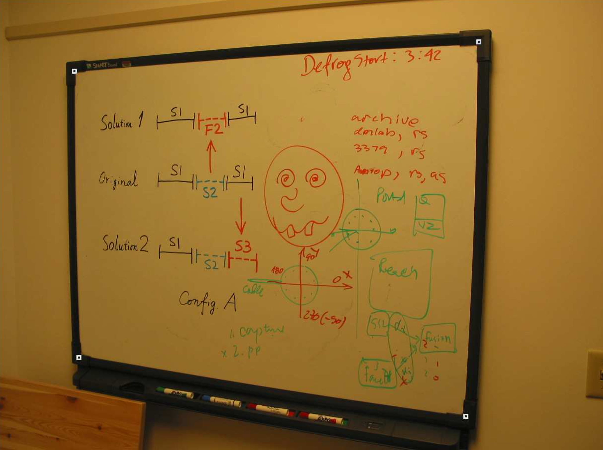
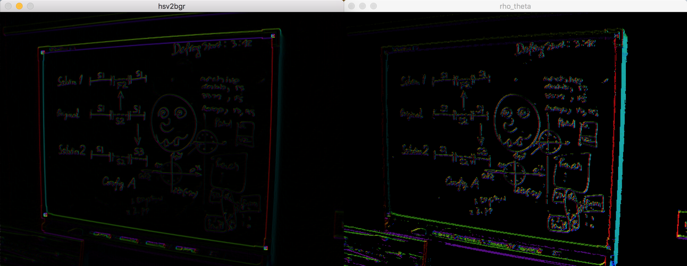

# VisualizationTools
This is a repository supporting tools to visualize some image/video processing like optic flow or Sobel gradient.

This visualization tools is based a useful trick in optic flow visualization, which use HSV color space to display a field with vectors. H, the hue, is inferred to the angles in field, and V, the value, is inferred to magnitude of each vector in field. Each angle in color displaying by hue is roughly map by following image.


## Requriment
Python, Numpy and OpenCV-python package, and the opencv-python package can be installed by following instruction on Linux/OSX system:

```
pip install opencv-python
```

## Example
To test whether my tools is good on your system, you can run my test by following instruction under this VisualizationTools folder:

```
python ../tools/visualize_vectors_field.py test.png
```

and then you can see some result as below:



The 'hsv2bgr' in left is representing a gradient of test.png by Sobel operations. You can see that purple line is inferred that this line gradient angle is about -90 degree, red one is about 0 degree, green one is about 100 degree.